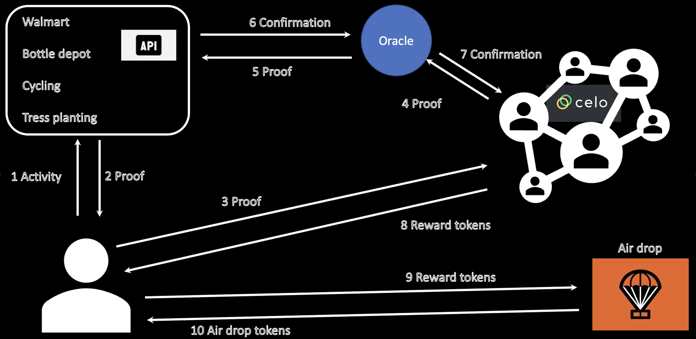

## ⚡ SUStainability Tokens (SUST): Everyone's Crypto ⚡

#### Theme
DeFi (ReFi) - Public Good

##### Team
Muni Venkateswarlu Kumaramangalam  
Blockchain Developer, 
Catalyst Technologies Ltd.
Calgary, Canada

#### Project Description
This is a demo project designed to tokenize sustainability behaviours and efforts to reward the individuals exercising the regenerative behaviour. 
For example, let us take the example of using reusable bags or avoiding plastic bags usage while shopping. Users who exercise this sustainability behaviour will be issued a specific ERC20 token, called SUStainability Token (SUST). SUST holders are given preference when new crypto projects are launched and opt to distribute their tokens out to the greater population through airdrops. Higher the number of token holdings higher the priority during the airdrops. For demo use, I used Celo testnet Alfajores. 

#### How to run the project
- Step 1 : Clone the repo
- Step 2 : Make sure you have Node installed
- Step 3 : Open the terminal and navigate to the "frontend" folder
- Step 4 : run the command "npm install"
- Step 5 : run the command "npm start"
- Step 6 : Open a web browser and type localhost:3000 and enter
- Step 7 : Have fun with the UI

#### URLs
Check this video for the sample execution of the project: 
https://youtube.com/playlist?list=PLi6LaqPTG8nZ1y17BvBlvLYjX__5BuRZ3

#### System design

#### License
This repository includes an [unlicensed](http://unlicense.org/) statement though you may want to [choose a different license](https://choosealicense.com/).
